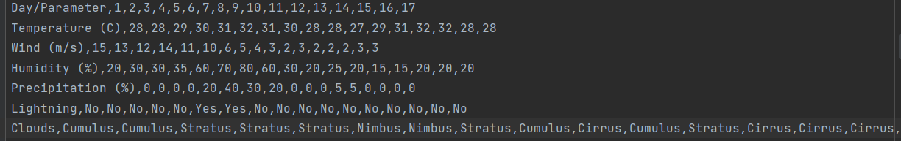
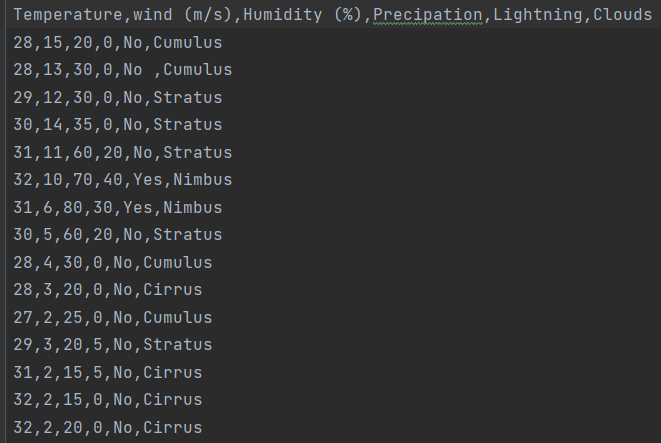

# SPACE Programme task   
The application analyzes the weather from the csv file 
which is given as an input and makes a csv file that contains the best day(s) for launching the space shuttle.  
The csv file is sent to the recipient's email.   
If there are multiple days that match the criteria then they are sorted firstly by wind and then by humidity.  
If there are multiple days that are with the same wind and humidity then all of them are returned.

## Input:
1. csv filename
2. Sender email
3. Sender password
4. Recipient email

### Note
For the Email service you might need to add the dependencies that are in activation-1.1.1.jar and javax.mail.jar.

If you are using gmail (as I did) then in https://myaccount.google.com/security you need to set up an App password and use that password. 

### Note 2
There are two functions that read from a file (for both variants of forming a csv file)
The first one is readFromFile() (this is currently the used function) and reads from a csv that looks like 
   
The second one is readFromFile2() and reads from a csv that looks like
   
The function is called on line 73 in SpaceShuttleLauncher.java
